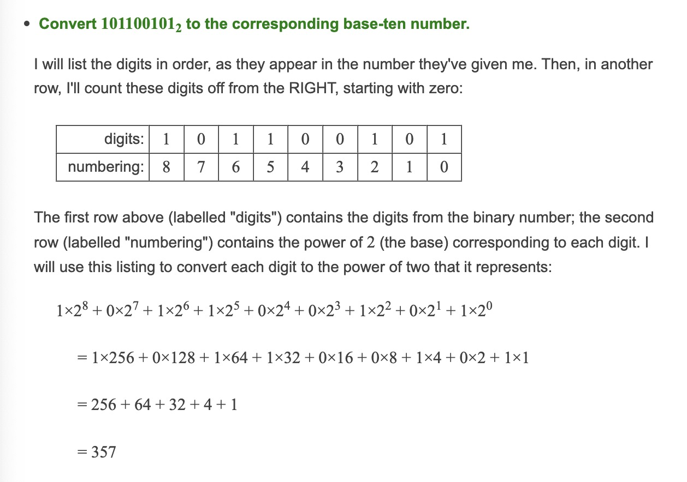
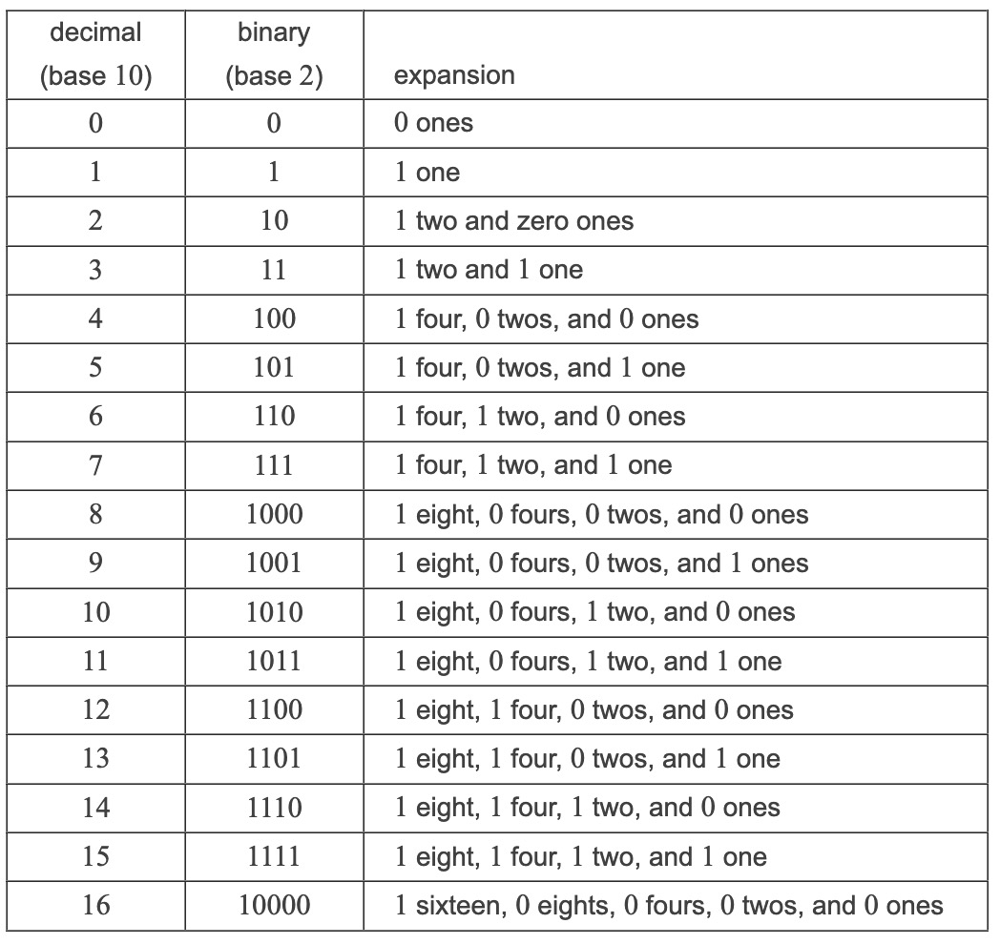

# Binary

**_Digits in binary are called bits._**

Binary are values that use two digits only **_0 and 1_** to represent all data in computing.

## How do computer use binary?

Computers use binary because electronic circuits easily represent two states `(on/off, high/low voltage)`.

**This simplicity leads to more robust, reliable hardware while keeping the nature of it simple.**

These 0 and 1s can be arrange in any format to create strings images or even data packets and text.

## What is it?

It's a base-2 number system.

Unlike our normal decimal system which is base-10.

When you wish to convert a number to base 2 you have to keep dividing it by 2 and keep track of the remainder


And when we do the conversion from binary to the normal base 10 number system we know we do the opposite we mark the positions and place the value at the position as the exponent with 2 being the base



**_NOTE: In base 10 the same will be done we will just make the exponent base 10 instead of 2_**

## This is beneficial to know as computers operate by shuffling these Zeros and ones around as base 2 is the lifeline of computers

---

## Base number observations

- In **_standard base-10_** number system - we have ten digits: 0, 1, 2, 3, 4, 5, 6, 7, 8, and 9. In which 10 is excluded `10 is excluded as we only use single digits and we only have 0-9 to do that`

- On the other hand, in the **_octal system_** (that is, in the base-8 system), there are only eight digits: 0, 1, 2, 3, 4, 5, 6, and 7. `NOTE: Here 8 is left out in the base 8 system as we start from 0 and go up, when we do this 7 becomes our 8th digit`

- And in the **_hexidecimal system_** (that is, in the base-16 system), there are sixteen digits: 0 through 9, followed by A, B, C, D, E, and F. `NOTE: We start to use numbers as we can not use double digits to represent numbers, we need to move onto using alphanumeric characters`

---

Here is a basic mapping of binary base 2 to standard base 10 conversion mapping image



---

Practice =>

```pseudo
1₂ = 1₁₀
10₂ = 2₁₀
11₂ = 3₁₀
100₂ = 4₁₀
```

---

When working with binary value mutation you need to always line up the values on a digit level

## Binary Addition

These are the golden rules for subtraction:

```pseudo
0 + 0 = 0

0 + 1 = 1

1 + 0 = 1

1 + 1 = 10 (which means write 0 and carry 1 to the next column)
```

**_NOTE: The values that are greater are carried over to the next digit_**

Break down of this calculation:

```pseudo
  1011
+ 1101
```

Rightmost column: 1 + 1 = 10
→ Write 0, carry 1.

Next column: 1 + 0 + carried 1 = 1 + 0 + 1 = 10
→ Write 0, carry 1.

Next column: 0 + 1 + carried 1 = 0 + 1 + 1 = 10
→ Write 0, carry 1.

Leftmost column: 1 + 1 + carried 1 = 1 + 1 + 1 = 11 (which is 3 in decimal)
→ Write 1, and carry 1 to a new column on the left.

Final result: With the extra carried 1, the sum is 11000.

## Binary Subtraction

These are the golden rules for addition:

```pseudo
• 0 – 0 = 0

• 1 – 0 = 1

• 1 – 1 = 0

• 0 – 1 = (needs borrowing from the next higher bit)
```

**_NOTE: When you borrow in binary, you subtract 1 from the next left bit and add 2 to the current bit (since 2 in base‑2 is written as “10”)._**

Break down of this calculation:

```pseudo
  1100
- 1011
```

Rightmost column: 0 – 1
→ 0 is less than 1, so borrow 1 from the next column:

```pseudo
          C3   C2   C1   C0
Minuend:   1    1    0    0
Subtrahend:1    0    1    1
```

We borrow the 1 by moving the 1 to the 0 to make a 2 in binary => 10<sub>2</sub>

```pseudo
          C3   C2   C1   C0
Minuend:   1    0   10    0
Subtrahend:1    0    1    1
```

At this point we need to borrow again since the 0 position has no value to result in a positive calculation. When we move and borrow the 1 again we leave the borrowed value from the column in the previous essentially setting all columns to 1 from the column where the value was borrowed

```pseudo
          C3   C2   C1   C0
Minuend:   1    0    1   10
Subtrahend:1    0    1    1
```

Now we can perform the subtraction of 1 so we begin:

$10_2 - 1 = 1$ Since $10_2$ is 2 in base 2 binary

```pseudo
          C3   C2   C1   C0
Minuend:   1    0    1   10
Subtrahend:1    0    1    1

Result:    1    0    1    1
```

Now that our columns are balanced and we no longer need to balance we can perform subtractions as normal.

```pseudo
          C3   C2   C1   C0
Minuend:   1    0    1   10
Subtrahend:1    0    1    1

Result:    0    0    0    1
```

Result: The difference is 0001 (or simply 1 in binary).

**_NOTE: You can do exponents like this in markdown 10<sup>2</sup>_**
