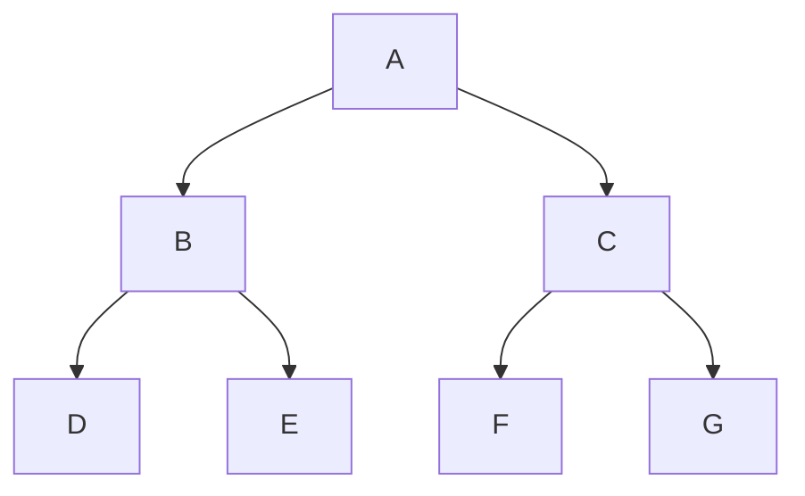
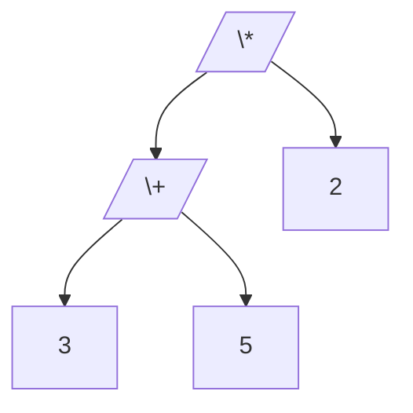
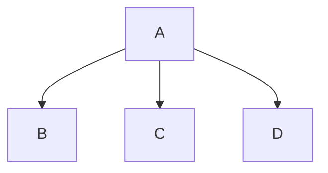
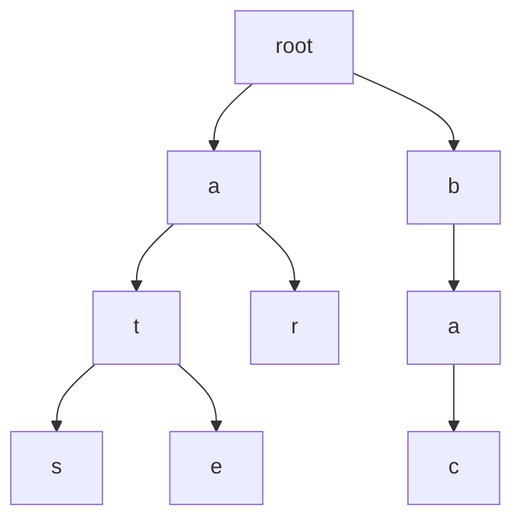
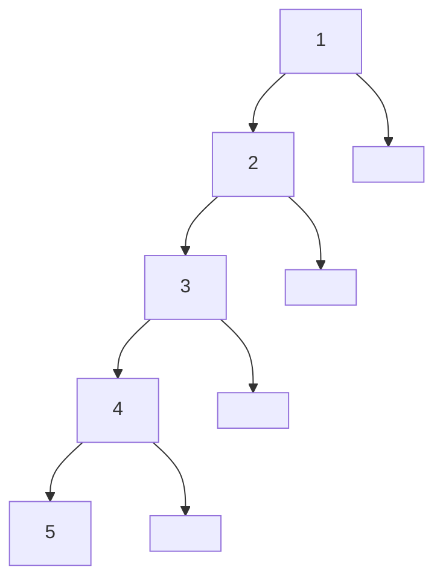
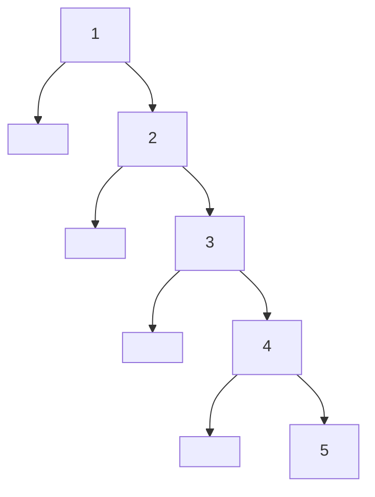
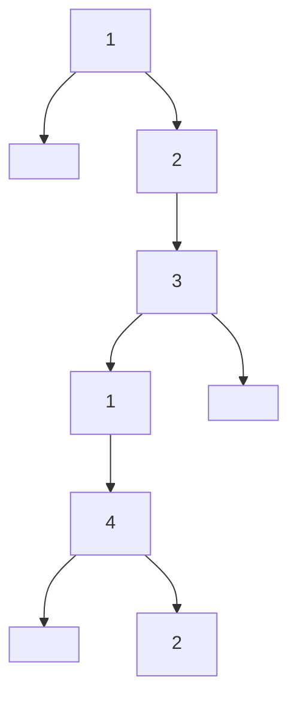

# Traversal Orders

## Orders Breakdown

Example Binary tree:



[] indicates nodes when they are selected in the visitation chain during dfs recursion.

### Pre-order

```pseudo
Parent -> Left -> Right
```

This is good for copying the tree or serializing it. \*\*You would serialize it to send it over a network in an application or to persist its structure within a file or database, or if you intend to clone the tree via a deep copy.

DFS would result in the nodes being visited in the following order:

```pseudo
[A] -> [B] -> [D] -> B -> [E] -> B -> A -> [C] -> [F] -> C -> [G]
```

### In-order

```pseudo
Left -> Parent -> Right
```

This is useful for binary search trees to retrieve all elements in a sorted order.

DFS would result in the nodes being visited in the following order:

    A -> B -> [D] -> [B] -> [E] -> B -> [A] -> C -> [F] -> [C] -> [G] -> C -> A

### Post-order

```pseudo
Left -> Right -> Parent
```

This is ideal for tree deletions or evaluating [expressions in expression trees](#expression-trees)

### Reverse post order

### Expression Trees

Example expression tree



Expression trees are trees that are used to represent an expression.

NB: **_In these trees, internal nodes represent operators and each leaf node represents a value._**

#### If we look at the order traversal effect on this tree we can see:

In-order Traversal: Yields the original expression in infix notation

```pseudo
3 + 5 * 2
```

Pre-order Traversal: Yields the expression in prefix notation

```pseudo
* + 3 5 2
```

Post-order Traversal: Yields the expression in postfix notation

```pseudo
3 5 + 2 *
```

<br/>

### The impact of picking a traversal order

Each of the orders discussed allow us to access the nodes in specific orders which allow us to manipulate the binary tree in specific ways.

The choice of order depends on the problem you are trying to solve.

<br />

**_These traversal methods work in all other tress as they all have parent to child node relationships_**

### Application on unique types

#### N-ary Trees

These have the same traversal orders as binary trees.



Pre-order: **A, B, C, D**

#### Tries

Pre order traversal is the most common and is used to gather strings or words efficiently.

#### Trie (Prefix Trees)



Pre-order: **root, a, t, s, r, e, b, a, c**

<br />

### Skewed Trees

These are binary trees that have only one child for each parent, either the left or the right.

These have a 1 to 1 relationship from parent to child. And they resemble linked lists.

#### Left Skewed



#### Right Skewed



#### Alternating Skewed


