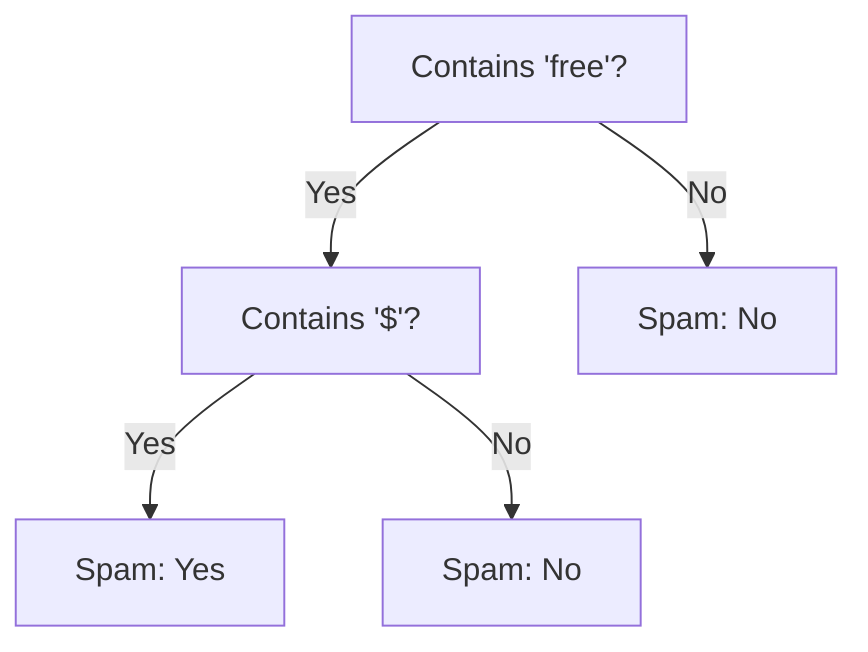

# Decision Tree

These are trees that are used for making structured decisions or are used to solve classification/regression problems.

Decision tress most commonly mimic binary trees, where the decisions in the tree split into two branches often representing `Yes` or `No`.

It is possible for decisions to split into more then 2 decision branches. We will in that case have a N-ary tree like structure. Another example of this is like a chess game, a node might have multiple branches representing the possible moves that can be made on the chess board.

This data structure often helps to solve problems that require step-by-step narrowing of possibilities to get to a solution.

## Decision tree visuals

Decision Trees are a form of binary tree and can be a form of N-ary tree. It contains 2 types of nodes.

- Leaf nodes - The same as ones in a binary tree with no children.

- Decision nodes - The non leaf nodes.

Each decision node in the Tree has branching rules that can be expressed as follow:

```java
if (condition == true) {
    object goes to the left child node;
} else {
    object goes to the right child node;
}
```

## Examples

### In the real world the there are a few examples such as

- Medical Diagnosis - Where the nodes represent questions for example. 'Does the patient have a fever'? and based on the answer we will keep traversing until we reach a leaf node where we will be suggested a diagnoses or actions to take such as 'Prescribing medication' or 'You have a common flu'.

- Loan Approval - Where the nodes represent the criteria for example. 'Is the credit score > 700' and based on the answer the branches represent the outcomes eg (Approved or Rejected). The leaf nodes in this case after traversing all decisions will represent the final loan decision.

## Model Inference

To apply a decision tree for classification of a sample is called `model inference` in machine learning.

To apply this tree is to traverse from the root to leaf.

As you traverse you start gathering a chain of decision nodes. This chain explains how the label from the leaf node was acquired this chain is **_Thus a set of rules that serve as natural `interpretability` for the decision tree model. This is the reasoning for the end decision and it is understandable to humans, the break down of actions the machine took_**

The inverse of interpretability is the absence of human comprehension for the rule chain this is what we call a **_Blackbox model_** of which neural networks are an example.

## Algorithmic Examples

To construct a decision tree using the [divide and conquer](../../Algorithms/Recursion/DivideAndConquer/) strategy.

In a decision tree, the input data is divided into two subgroups at each decision node based on specific criteria such as Gini impurity, information gain, or chi-square (These are some features that provide the best split conditions according to metrics provided).

- **Gini impurity**: This is the frequency measured at which any element of the dataset would be misclassified when randomly labeled.

  For example, if a node contains 60% of class A and 40% of class B, the Gini impurity is calculated as \(1 - (0.6^2 + 0.4^2) = 0.48\).

- **Information gain**: This measures the reduction in entropy (Entropy is a measure of the randomness or impurity of the data. This often used to quantifies the randomness of the data) or surprise by splitting the dataset based on an attribute.

  For example, if the entropy before the split is 1 and after the split is 0.5, the information gain is \(1 - 0.5 = 0.5\).

- **Chi-square**: This statistical test measures the difference between observed and expected frequencies.

  For example, if we expect 50 emails to be spam and 50 not spam, but observe 70 spam and 30 not spam, the chi-square value helps determine if this difference is significant.

This splitting process continues recursively for each subgroup until a stopping condition is met, such as all samples in a subgroup belonging to the same category or reaching a maximum tree depth.

After the splitting process is complete, each sample is assigned to a leaf node. A leaf node is the final node in a path from the root of the tree. Each leaf node is labeled with the category that has the majority of samples within that node.

## Implementation Example

### Base Case

If the samples are have the same labels / leaf nodes then we do not need to further split the samples. You can have more to regulate the complexity of the final tree.

### Recurrence Relation

We will find the most distinguishable feature of the samples and the best value to split on, in order to obtain two subgroups of samples. We then create a subtree with these subgroups and continue.

These are the steps we will follow:

1. We reduce the samples into smaller scales in a fast manner. To reduce the recursive stages to reduce the cost of the algorithm.

2. We should then make sure that the split subgroups are more uniform so that it becomes easier to classify the samples.

Here is a pseudo code example:

```java
TreeNode build_decision_tree([samples]) {

  // base cases:
      - the target attributes of the samples are uniform
      - the current depth of tree exceeds the max_tree_depth
      - the number of samples is less than the minimal_node_size

  // 1). we create a leaf node and return.
  if (any of the above cases are truthy) {
    leaf_node = create_leaf_node([samples]);
    return leaf_node;
  }

  // 2). find the best attribute to split on, (also the best value to split) - this can be done using the Gini impurity and information gain algorithms to name a few
  feature_to_split, split_value = find_best_split([samples]);

  // 3). split the samples list into two sublists
  left_samples, right_samples = split([samples], feature_to_split, split_value);

  // 4). create a decision node. (This node will have children and the children will go through the same creation process this node went through if this point is reached)
  new_node = create_node(feature_to_split, split_value);

  // 5). for each sublist, recursively call the function to create the subtrees.
  // Here we are opening up new contexts of recursion that will return here and set the value to the node built within its execution context due to the *new_node* return a few lines below
  new_node.left = build_decision_tree(left_samples);
  new_node.right = build_decision_tree(right_samples);

  // 6). return the newly-created node to the outer recursive scope!!!!!!!!!!!!!!!!!!!! :)
  return new_node;
}
```

## Stopping Conditions

A decision tree keeps growing from top to bottom and it stops growing when a leaf node is added to the tree. Based on the base case these are our conditions for when we will stop splitting the samples:

(Natural)
1. All the samples that are in the current decision node belong to the same category after the splitting logic was implemented. (Both subgroups refer to the same labels or classifications) **_ie No further classification is needed or can be made to split the data_**
(Preventative - Preventing the tree from overgrowing)
2. The tree reaches the Predefined `max_depth`.

(Preventative - Preventing the tree from overgrowing)
3. If the number of samples that fall in the current decision node are less than the predefined `minimal number of samples` value.

These preventative base cases stop us from falling into a scenario where we are overfitting data into our tree. This is called `regularization` in machine learning, which is the act of preventing this.

## Spam Example

Decision trees can be used to classify data based on the attributes it holds.

An example of this is predicting whether an email is spam or not based on features that it contains such as subject line, the sender details, and if it contains spam keywords.

Path finding has been used.

## How do decision trees solve algorithmic problems

They model decision hierarchies. And by doing this they divide problems into smaller chunks.

Here is an example of a decision tree for the classification of spam:



If we start from the root we can end at a leaf node by answer the questions that the nodes answer.

**These data structures are used for classifications and predictive modeling across fields like, medicine, finance, AI, etc.**

The strength of the DS lies in its ability to decompose hierarchical problem into smaller chunks and in their ability to handle uncertainty.

### An example algorithm is the ID3 (Iterative Dichotomiser 3)

<br />

## Splitting Criterion

This is the most important part of the Decision tree. The actual decision formation. This is done by spliting the given samples into two subgroups.

- The splitting of samples/data into subgroups leads us to achieve a termination point for our recursive processes.

- The feature to split on and the value to split with, are the branching conditions for the decision nodes.

- The splitting of subgroups contains recursively to further construct the left and right subtrees.

How you split the samples is completely your choice. You need to use your understanding of the different techniques to pick the best one for your use case.

