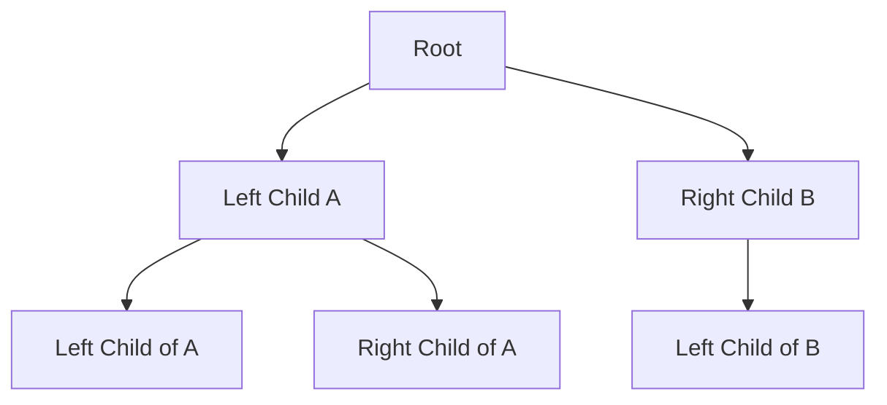

# Heap

## Technical heap description

Heaps are -

-

Heaps are a data structure that is a **Special binary tree**. It is a tree that has the following properties:

- It is a complete binary tree. `( A complete tree is a tree that has all levels complete with nodes expect the last one. All nodes in the last level should be filled from the furthest left node possible )`



<br />

***The tree is still valid if the left nodes of the last row are populated. Only - If there are gaps in the last row the binary tree is not valid.***

<br />

- The value of each node must be greater than / or less than the value of its children based on the [variant](#variants)

## Its similarity to priority queues

Heaps and priority queues are not the same. A priority queue is a abstract data type while a Heap is a data structure.

A priority queue is similar to an array (a queue or stack) where each element has a priority associated with it. For example high priority elements are served before low priority ones in this structure.

For example a priority todo list where high priority tasks get complete before others.

## Why are Heaps a good way to implement priorities

Heaps allow us to perform insertions and deletions with a time complexity of $O(logN)$

### Variants

- Max Heap

    Each node in the heap has a value no less than its child node. This means that the top element (root node) will always have the highest value.

    ```mermaid
    graph TD;
        A[50]
        A --> B[30]
        A --> C[20]
        B --> D[15]
        B --> E[10]
        C --> F[8]
        C --> G[5]
    ```

- Min Heap

    This is the inverse of the max heap and positions its self so that the root node is the smallest value in the heap with the last row being the highest values.

    ```mermaid
    graph TD;
        A[5]
        A --> B[10]
        A --> C[15]
        B --> D[20]
        B --> E[25]
        C --> F[30]
        C --> G[35]
    ```

In these variations the orientation of the values in min or max are kept when you read each of the levels of the binary tree from left to right.

## Heap insertions

asdf

## Heap deletions

asdf

<br />

## Heaps commonalities with the OG Binary trees

The heap shares properties with binary trees as they have to be complete and only have 2 children per parent node in the graph data structure.

As these we can use the array visualization of binary trees to manipulate the value at each of the child and parent indexes.

To get a child node's parent node we use the following formula:

```pseudo
(Parent node index) = floor((i - 1) / 2)
```

Where `i` is the index of the child node.

&&

```pseudo
2 x (index of Parent Node) + 1 => (Index of the Left child in the array visualization)

2 x (index of Parent node) + 2 => (Index of the Right child in the array visualization)
```
