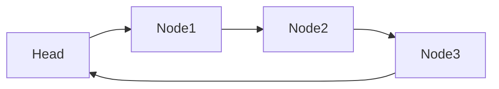

# Linked List

Linked lists are graph like data structures where each node in the graph points to the next node in the structure.

Think a conga line or people holding hands in the church isles.

## Technical linked list description

A linked list is a linear data structure where each element, called a node, contains a data part and a reference (or link) to the next node in the sequence. This structure allows for efficient insertion and deletion of elements, as it does not require shifting elements like in an array.

### So simply

Sure! A linked list is a data structure that consists of a sequence of elements, where each element (called a node) contains two parts: the data and a reference (or pointer) to the next node in the sequence.

### In-Memory Representation

When a linked list is stored in memory, each node is allocated a separate block of memory.

These blocks are not sequential, meaning they can be scattered throughout the memory.

The reference (or pointer) in each node holds the memory address of the next node you need to visit in the chain, creating the a chain-like structure we know linked lists to have.

### Key Characteristics

- **Dynamic Size**: The size of a linked list can grow or shrink dynamically.

- **Ease of Insertion/Deletion**: Elements can be easily inserted or removed without reorganizing the entire structure.

- **Memory Usage**: Each node requires extra memory for storing the reference to the next node.

### Types of Linked Lists

- **Singly Linked List**: Each node points to the next node.

- **Doubly Linked List**: Each node points to both the next and previous nodes.

- **Circular Linked List**: The last node points back to the first node, forming a circle.

### Example

Singly linked list

Doubly linked list

Circular linked list

