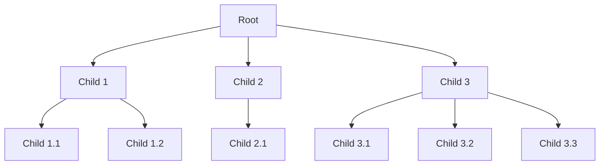

# N-ary Trees

These are a type of graph tree structure that share properties with the OG Binary tree.

The primary difference between N-ary trees and binary trees is that N-ary trees can have parent nodes with any number of child nodes, whereas binary trees are limited to at most two children per node.

For example, the root node in an N-ary tree can have 2 children, one of those children can have 4 children, and so on.

This means that the array visualization of these trees will no longer follow the standard formula from the binary tree `2 * i + 1 && 2 * i + 2`

**Not all N-ary trees are binary trees, as N-ary trees can have any number of children per parent node.** ***As soon as they break the mold of what a binary tree is we need to apply new rules to it.***

## Applications for N-ary trees

- **File Systems**: N-ary trees are used to represent hierarchical file systems where directories can contain multiple files and subdirectories.

- **Organizational Structures**: They can model organizational charts where each manager can have multiple direct reports.

- **Game Trees**: Used in AI for games to represent possible moves in games like chess, where each position can lead to multiple future positions.

- **XML/HTML Parsing**: N-ary trees are used to parse and represent the structure of XML and HTML documents.

- **Trie Data Structures**: Used in implementing tries (prefix trees) for efficient retrieval of strings in a dataset.

---

Tries are a form of N-ary tree!

