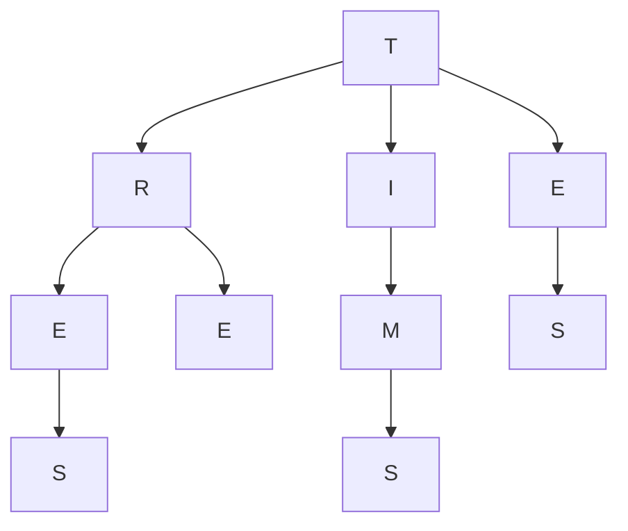

# Tries

Tries are a implementation of N-ary trees where each node in the tree can have up to N children.

Tries are often used to create prefix trees, or trees that are used to find common terms for auto complete functionality when using search features on websites and applications.

**The letters in this trie spell out the words "TREE", "TRIES", "TIMES".**
